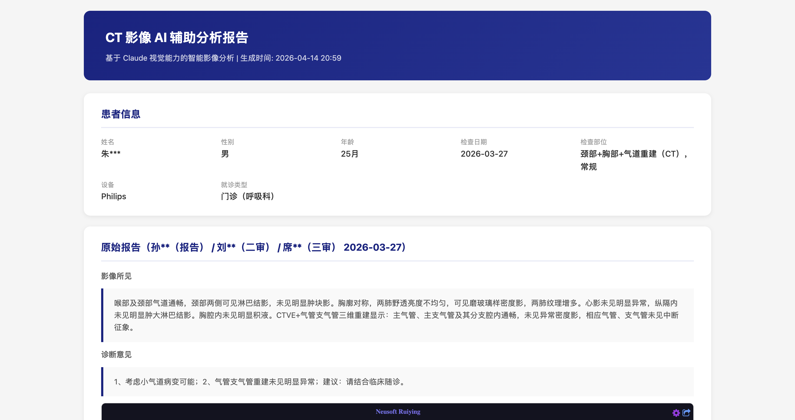
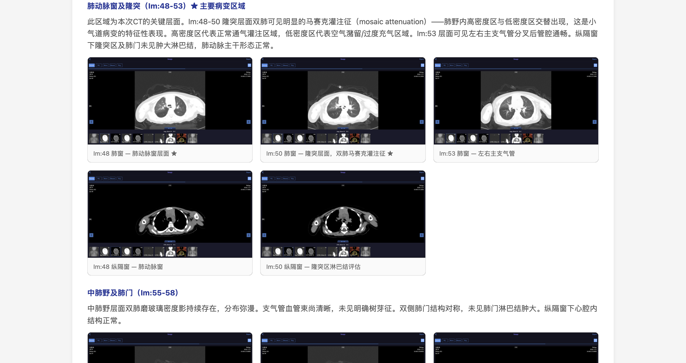

# CT Reader - CT 影像 AI 辅助解读

通过 Chrome DevTools MCP 自动打开 CT 影像云胶片页面（如东软睿影 PACS），截取关键层面截图，利用 Claude 视觉能力进行独立读片分析，生成结构化 HTML 报告。

## 功能特点

- **多种输入方式**：支持直接提供 URL 或含二维码的图片（自动解码提取链接）
- **自动化浏览**：通过 Chrome DevTools MCP 自动操控 PACS 查看器，按序列、层面截取关键 CT 图像
- **独立 AI 读片**：基于 Claude 视觉能力对每张截图进行独立分析，不仅仅复述原始报告
- **诊断-图片对应**：分析结果按解剖区域组织，每个诊断发现对应具体 CT 截图
- **单文件 HTML 报告**：所有截图以 base64 内嵌，生成的 HTML 文件可直接在浏览器中打开和分享

## 报告示例

**报告头部** — 患者信息（脱敏）+ 原始报告：



**AI 影像分析** — 诊断发现与 CT 截图一一对应（肺窗 + 纵隔窗对照）：



报告包含以下部分：
- **患者信息**：姓名（脱敏）、性别、年龄、检查日期、检查部位等
- **原始报告**：医院放射科出具的影像所见和诊断意见
- **AI 影像分析**：按解剖区域逐区分析，每个区域配对应 CT 截图
- **印象与建议**：综合分析结论和后续建议

## 前置条件

- [Claude Code](https://claude.ai/code) CLI
- Chrome 浏览器
- `chrome-devtools` MCP Server（`npx chrome-devtools-mcp@latest`）
- `zbarimg`（用于二维码解码）：`brew install zbar`
- Python 3

## 使用方法

在 Claude Code 中触发 CT 报告解读技能：

**方式一：直接提供 URL**
```
CT 报告解读：https://example.com/short/xxxxx
```

**方式二：提供含二维码的图片**
```
帮我解读这张 CT 报告：/path/to/qr_photo.jpg
```

Claude Code 会自动：
1. （如为图片）解码二维码提取 URL
2. 打开 CT 影像云胶片页面
3. 提取报告信息和患者资料
4. 进入图像查看器，按序列截取关键层面（肺窗、纵隔窗、冠状位、气道重建）
5. 对每张截图进行独立分析
6. 生成 HTML 报告并在浏览器中打开

## 输出文件

```
output/
├── screenshots/          # CT 截图（~40 张）
│   ├── 00_report_page.png
│   ├── 01_lung_im05.png ~ 20_lung_im76.png    # 肺窗 20 张
│   ├── 21_std_im25.png ~ 29_std_im72.png       # 纵隔窗 9 张
│   ├── 30_coronal_im20.png ~ 32_coronal_im60.png  # 冠状位 3 张
│   └── 33_processed_im1.png ~ 38_processed2_im4.png  # 气道重建 6 张
├── report_data.json      # 结构化报告数据
└── ct_report.html        # HTML 报告（可直接浏览器打开）
```

## 项目结构

```
ct-reader/
├── SKILL.md              # Claude Code 技能定义（核心工作流）
├── generate_report.py    # HTML 报告生成器
├── decode_qr.sh          # 二维码解码脚本
├── docs/                 # 文档资源
│   ├── report_preview_header.png
│   └── report_preview_findings.png
├── .gitignore
└── README.md
```

## 支持的 PACS 系统

目前已验证支持：
- **东软睿影**（Neusoft Ruiying）云胶片系统 V1.0

## 免责声明

本工具生成的报告由 AI 辅助分析，仅供参考，不构成医疗诊断。所有医疗决策请以执业放射科医师的正式报告为准。
